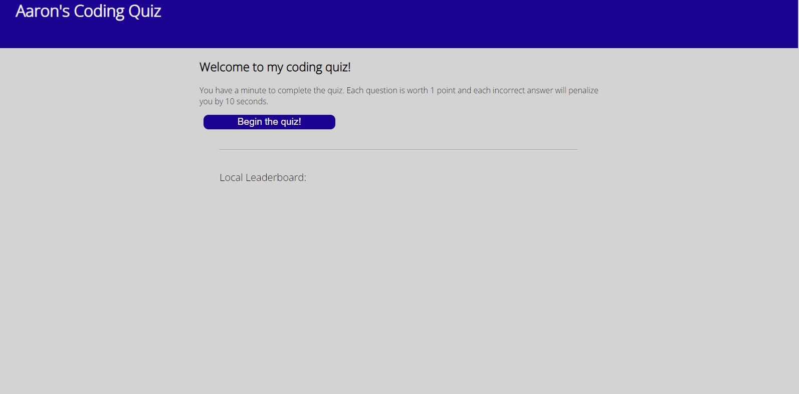

# Wed-dev-quiz

## Description

A quiz based on web development and specifically Javascript. There are 10 questions in total. When a user gets an answer correct, their score increases. when a user gets an answer incorrect, they lose 10 seconds out of the 1 minute given to take the quiz.

Script lines 7-71 formatting of an array of objects given by Mr. Machok

Semantics for creating a JSON, setting localStorage, and getting localStorage aided by a friend, Jen Nguyen. Logic self-applied.

## Link

https://aalyman42.github.io/Web-dev-quiz

## Screenshot

